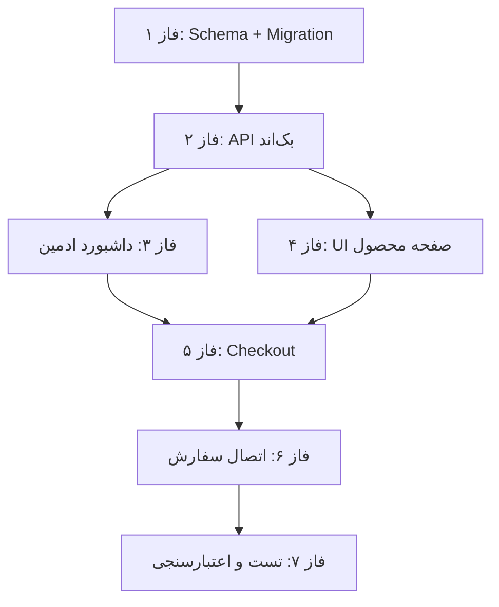

# پلن جامع: افزودن «نوع محصول» (Product Variant) و «ویدئو محصول» به سیستم

## خلاصه تغییرات

این سند یک پلن فازبندی‌شده و جامع برای افزودن دو ویژگی جدید به سیستم است:

1. **ویدئو محصول** — بخش ویدئو در حال حاضر در فرانت‌اند پیاده‌سازی شده، ولی بخش مدیریت ادمین و UI/UX صفحه محصول نیازمند بهبود است.
2. **نوع محصول (Product Variant)** — مفهوم جدید و مجزا از `Plan`. هر محصول می‌تواند چندین «نوع» داشته باشد (مثلاً پرو، پلاس، دانشجویی، اولترا) که هر کدام نام، قیمت، تخفیف، مدت‌زمان و ویژگی‌های مخصوص به خود را دارند.

---

## تفاوت بین Plan و Product Variant (نوع محصول)

> [!IMPORTANT]
> **این تفاوت اساسی است و باید در تمام لایه‌ها رعایت شود:**

| مفهوم | Plan (پلن) | Product Variant (نوع محصول) |
|---|---|---|
| **هدف** | نحوه تحویل/دریافت اکانت | نوع/تیر/سطح محصول |
| **مثال** | لینک فعال‌سازی، اکانت آماده، روی جیمیل شما | پرو ۱۲ ماهه، پلاس ۶ ماهه، دانشجویی ۳ ماهه |
| **شامل چه می‌شود** | `fulfillmentType`, `checkoutFields` | نام نوع، قیمت، تخفیف، مدت‌زمان، ویژگی‌ها |
| **رابطه** | هر Plan متعلق به یک Product Variant (یا مستقیماً به Product) | هر Variant متعلق به یک Product |

**جریان خرید جدید:**
```
محصول → انتخاب نوع محصول (Variant) → انتخاب پلن (نحوه تحویل) → Checkout → پرداخت
```

---

## وضعیت فعلی سیستم (تحلیل کدبیس)

### دیتابیس (Prisma Schema)
- مدل `Product`: دارای فیلد `videoUrl` (پیاده‌سازی شده ✅)
- مدل `Plan`: دارای `planType` (در حال حاضر به‌عنوان یک فیلد ساده `String?` روی Plan تعبیه شده — این باید به یک مدل مجزا تبدیل شود)
- فیلد `planType` روی Plan فقط یک label ساده است و مدل مستقل با قیمت/تخفیف/ویژگی ندارد

### فرانت‌اند
- کامپوننت `ProductVideoSection` ✅ پیاده‌سازی شده
- کامپوننت `ProductDetailVisual` ✅ لینک به ویدئو دارد
- `ProductBuyCard` — انتخاب Plan با فیلتر بر اساس `planType` انجام می‌شود (مکانیزم Matrix Mode)
- صفحه Checkout — بر اساس `planId` کار می‌کند

### ادمین داشبورد
- `ProductDialog` — فیلد `videoUrl` ✅ پیاده‌سازی شده
- `PlanDialog` — فیلد `planType` با Chip‌های پیشنهادی ✅ موجود

---

## فاز ۱: طراحی و تغییرات دیتابیس (Database Schema)

### ۱.۱ ایجاد مدل `ProductVariant`

یک مدل جدید در [schema.prisma](file:///c:/Users/AFRAA/Desktop/ali/Projects/sell-google-acc/prisma/schema.prisma) اضافه شود:

```prisma
model ProductVariant {
  id               String   @id @default(cuid())
  productId        String
  name             String                    // نام نوع: "پرو", "پلاس", "دانشجویی", "اولترا"
  slug             String?                   // اسلاگ اختیاری برای URL
  description      String?                   // توضیح کوتاه درباره این نوع
  price            Int                       // قیمت اصلی به تومان
  discountedPrice  Int?                      // قیمت تخفیف‌خورده (اگر null یعنی تخفیف ندارد)
  discountLabel    String?                   // برچسب تخفیف: "۳۰٪ تخفیف", "ویژه نوروز"
  duration         Int          @default(1)  // مدت زمان بر حسب ماه
  features         Json?                     // آرایه‌ای از ویژگی‌های اختصاصی این نوع
  badge            String?                   // بج نمایشی: "پرفروش", "پیشنهاد ویژه"
  active           Boolean      @default(true)
  sortOrder        Int          @default(0)
  createdAt        DateTime     @default(now())
  updatedAt        DateTime     @updatedAt

  product          Product      @relation(fields: [productId], references: [id], onDelete: Cascade)
  plans            Plan[]       // هر Variant می‌تواند چندین Plan داشته باشد

  @@index([productId])
  @@index([productId, active])
  @@map("product_variants")
}
```

### ۱.۲ تغییرات در مدل‌های موجود

#### مدل `Product`
```diff
model Product {
  ...
+ variants        ProductVariant[]
  ...
}
```

#### مدل `Plan`
```diff
model Plan {
  ...
+ variantId       String?
  ...
+ variant         ProductVariant?  @relation(fields: [variantId], references: [id], onDelete: SetNull)
  ...
+ @@index([variantId])
}
```

#### مدل `Order`
```diff
model Order {
  ...
+ variantId       String?
  ...
+ variant         ProductVariant?  @relation(fields: [variantId], references: [id], onDelete: SetNull)
  ...
+ @@index([variantId])
}
```

> [!NOTE]
> **Backward Compatibility:** فیلد `variantId` در هر دو مدل `Plan` و `Order` اختیاری (`String?`) است، بنابراین داده‌های موجود بدون هیچ مشکلی کار خواهند کرد. محصولاتی که نوع (Variant) ندارند، مستقیماً از طریق Plan قابل خرید هستند.

### ۱.۳ Migration
```bash
npx prisma migrate dev --name add-product-variants
npx prisma generate
```

---

## فاز ۲: API بک‌اند

### ۲.۱ ایجاد API جدید: `/api/admin/variants`

**فایل جدید:** `src/app/api/admin/variants/route.ts`

| Method | عملکرد |
|--------|--------|
| `GET` | دریافت لیست Variant‌های یک محصول (`?productId=xxx`) |
| `POST` | ایجاد Variant جدید |
| `PATCH` | ویرایش Variant |
| `DELETE` | حذف/غیرفعال‌سازی Variant (مشابه منطق Plan — اگر سفارش دارد، غیرفعال شود) |

**فیلدهای POST/PATCH:**
```typescript
{
  productId: string
  name: string
  slug?: string
  description?: string
  price: number
  discountedPrice?: number | null
  discountLabel?: string | null
  duration: number
  features?: string[]
  badge?: string | null
  active?: boolean
  sortOrder?: number
}
```

### ۲.۲ تغییر API موجود: `/api/admin/plans`
- افزودن فیلد `variantId` به `POST` و `PATCH`
- در فرآیند ایجاد/ویرایش Plan، اگر `variantId` ارسال شود، رابطه ثبت شود

### ۲.۳ تغییر API موجود: `/api/admin/products`
- در `GET`: اضافه کردن `include: { variants: true }` به query
- Variant‌ها در پاسخ همراه محصولات برگردانده شوند

### ۲.۴ تغییر API عمومی: `/api/products/[slug]`
- در پاسخ، علاوه بر Plans، Variants هم برگردانده شوند
- هر Variant شامل Plans مرتبط خود باشد

### ۲.۵ تغییر API سفارش: `/api/orders`
- فیلد `variantId` به بدنه درخواست POST اضافه شود
- در فرآیند ایجاد سفارش، `variantId` به رکورد Order ذخیره شود
- اعتبارسنجی: اگر `variantId` ارسال شده، بررسی شود که واقعاً به `productId` تعلق دارد
- قیمت: اگر Variant انتخاب شده، قیمت از Variant گرفته شود (با احتساب `discountedPrice` در صورت وجود)

---

## فاز ۳: داشبورد ادمین (Admin Panel)

### ۳.۱ ایجاد مدال جدید: `VariantDialog`

**فایل جدید:** `src/app/dashboard/products/components/variant-dialog.tsx`

> [!IMPORTANT]
> مدال Variant باید **کاملاً مجزا** از مدال Plan باشد. از الگوی UI/UX فعلی `PlanDialog` و `ProductDialog` الهام گرفته شود تا هماهنگی تم حفظ شود. **فقط از رنگ‌های اصلی تم (`primary`, `foreground`, `muted`, `border`) استفاده شود.**

**فیلدهای مدال:**
- نام نوع محصول (text input)
- توضیحات (textarea — اختیاری)
- قیمت اصلی (number input با نمایش فارسی و حروفی)
- قیمت تخفیف‌خورده (number input — اختیاری)
- برچسب تخفیف (text input — اختیاری، مثلاً "۳۰٪ تخفیف")
- مدت‌زمان به ماه (number input با Stepper)
- ویژگی‌ها (آرایه از string — قابل افزودن/حذف، مشابه features محصول)
- بج نمایشی (text input — اختیاری، مثلاً "پرفروش")
- وضعیت فعال/غیرفعال (Switch)
- ترتیب نمایش (number input با Stepper)

### ۳.۲ تغییر Hook: `use-products.ts`

- افزودن state و توابع مربوط به Variant:
  - `variantDialogOpen`, `isEditingVariant`, فیلدهای فرم، ...
  - `openCreateVariantDialog(productId)`, `openEditVariantDialog(variant)`, `handleSaveVariant()`, `handleDeleteVariant()`

### ۳.۳ تغییر Types: `types.ts`

```typescript
export interface VariantItem {
  id: string
  productId: string
  name: string
  slug?: string | null
  description?: string | null
  price: number
  discountedPrice?: number | null
  discountLabel?: string | null
  duration: number
  features?: string[] | null
  badge?: string | null
  active: boolean
  sortOrder: number
  plans?: PlanItem[]
  _count?: {
    orders: number
  }
}

// تغییر ProductItem
export interface ProductItem {
  ...
  variants?: VariantItem[]
}
```

### ۳.۴ تغییر `ProductTable`

- زیر هر محصول (در بخش Expand)، علاوه بر Plans، یک سکشن **«انواع محصول»** هم نمایش داده شود
- دکمه «+ نوع محصول جدید» در کنار دکمه «+ پلن جدید» اضافه شود
- هر Variant در جدول نمایش داده شود با: نام، قیمت، تخفیف (اگر دارد)، مدت‌زمان، تعداد Plan‌ها، وضعیت، دکمه ویرایش/حذف

### ۳.۵ تغییر `PlanDialog`

- اگر محصول Variant دارد، یک فیلد «نوع محصول مرتبط» (Select Dropdown) اضافه شود
- اگر محصول Variant ندارد، این فیلد مخفی باشد
- فیلد `planType` قدیمی حفظ شود (backward compatible) ولی اگر Variant انتخاب شده، `planType` به‌صورت خودکار از Variant پر شود

### ۳.۶ تغییر صفحه اصلی: `page.tsx` (Admin Products)

- مدال `VariantDialog` به صفحه اضافه شود
- KPI‌ها: افزودن آمار «کل انواع محصول» (اختیاری)

---

## فاز ۴: فرانت‌اند — صفحه اختصاصی محصول

### ۴.۱ طراحی UI/UX بخش «انواع محصول»

> [!IMPORTANT]
> از رنگ‌های فرعی استفاده نشود. فقط رنگ‌های تم (`primary`, `foreground`, `muted-foreground`, `border`, `card`, `background`) استفاده شوند.

**سناریو ۱: محصول بدون Variant (رفتار فعلی)**
- هیچ بخش Variant نمایش داده نمی‌شود
- انتخاب Plan مستقیماً از `ProductBuyCard` انجام می‌شود (بدون تغییر)

**سناریو ۲: محصول با Variant‌ها**

کامپوننت جدید: `ProductVariantSelector`

ساختار UI پیشنهادی:
```
┌──────────────────────────────────────────────────┐
│  🏷️ انتخاب نوع اشتراک                           │
│                                                    │
│  ┌──────────┐ ┌──────────┐ ┌──────────┐          │
│  │   پرو    │ │  پلاس   │ │ دانشجویی │          │
│  │ ۱۲ ماهه  │ │ ۶ ماهه  │ │  ۳ ماهه  │          │
│  │          │ │         │ │          │          │
│  │ ۱,۲۰۰,۰۰│ │۸۵۰,۰۰۰ │ │ ۴۵۰,۰۰۰ │          │
│  │ ~~۱,۵۰۰~~│ │         │ │          │          │
│  │ ۲۰٪ تخفیف│ │         │ │          │          │
│  │ پرفروش ⭐ │ │         │ │          │          │
│  └──────────┘ └──────────┘ └──────────┘          │
│                                                    │
│  ویژگی‌های نوع "پرو":                             │
│  ✓ دسترسی نامحدود به مدل‌های پیشرفته              │
│  ✓ پشتیبانی اولویت‌دار ۲۴/۷                       │
│  ✓ امکان استفاده API                               │
│                                                    │
│  ─────────────────────────────────                 │
│  🔧 نحوه تحویل (پلن):                             │
│  ○ لینک فعال‌سازی آنی    ○ اکانت اختصاصی آماده     │
│                                                    │
│  قیمت نهایی:  ۱,۲۰۰,۰۰۰ تومان                    │
│  [████████ ادامه و ثبت سفارش ████████]             │
└──────────────────────────────────────────────────┘
```

**هر کارت Variant شامل:**
- نام نوع
- مدت‌زمان
- قیمت اصلی (اگر تخفیف دارد، خط‌خورده نمایش داده شود)
- قیمت تخفیف‌خورده (درشت‌تر و برجسته‌تر)
- برچسب تخفیف (مثلاً "۲۰٪ تخفیف")
- بج (مثلاً "پرفروش" یا "پیشنهاد ویژه")

**پس از انتخاب Variant:**
- ویژگی‌های آن نوع نمایش داده شود
- Plan‌های مرتبط با آن Variant فیلتر و نمایش داده شوند
- اگر فقط یک Plan وجود دارد، به‌صورت خودکار انتخاب شود

### ۴.۲ تغییر `ProductBuyCard`

- اگر محصول Variant دارد:
  - ابتدا Variant Selector نمایش داده شود
  - سپس Plan‌های مرتبط با Variant انتخاب‌شده نمایش داده شوند
- اگر محصول Variant ندارد:
  - رفتار فعلی حفظ شود (بدون تغییر)

### ۴.۳ تغییر صفحه `[slug]/page.tsx`

- Variant‌ها از دیتابیس fetch شوند
- به `ProductBuyCard` پاس داده شوند
- اگر Variant ندارد، هیچ تغییری در رفتار ایجاد نشود

### ۴.۴ بهبود بخش ویدئو

ویدئو در حال حاضر پیاده‌سازی شده ✅ ولی این بهبودها اضافه شود:
- اگر محصول ویدئو ندارد: بخش ویدئو اصلاً رندر نشود (✅ قبلاً پیاده‌سازی شده)
- در ادمین: پیش‌نمایش ویدئو بعد از وارد کردن URL (✅ قبلاً پیاده‌سازی شده)
- بررسی اینکه صفحه محصول در نبود ویدئو هیچ فضای خالی یا بخش شکسته‌ای نمایش ندهد

---

## فاز ۵: فرانت‌اند — صفحه Checkout

### ۵.۱ تغییر صفحه Checkout (`checkout/page.tsx`)

- پارامتر `variantId` از URL خوانده شود
- اطلاعات Variant انتخاب‌شده در خلاصه سفارش نمایش داده شود:
  - نام نوع (مثلاً "پرو ۱۲ ماهه")
  - قیمت (با نمایش تخفیف اگر وجود دارد)
- در ارسال سفارش به API، `variantId` هم ارسال شود

### ۵.۲ تغییر `CheckoutOrderSummary`

- ردیف جدید «نوع محصول» در جدول خلاصه سفارش

### ۵.۳ تغییر `ProductBuyCard` — لینک Checkout

```typescript
// قبلی:
const checkoutUrl = `/checkout?slug=${slug}&planId=${selectedPlanId}`

// جدید:
const checkoutUrl = selectedVariantId
  ? `/checkout?slug=${slug}&variantId=${selectedVariantId}&planId=${selectedPlanId}`
  : `/checkout?slug=${slug}&planId=${selectedPlanId}`
```

---

## فاز ۶: اتصال به سیستم خرید و تست

### ۶.۱ تغییر فرآیند ایجاد سفارش

در [route.ts](file:///c:/Users/AFRAA/Desktop/ali/Projects/sell-google-acc/src/app/api/orders/route.ts):

```typescript
// 1. دریافت variantId از body
const { productId, slug, planId, variantId, checkoutData, ... } = body

// 2. اگر variantId وجود دارد، اعتبارسنجی:
if (variantId) {
  const variant = await prisma.productVariant.findUnique({
    where: { id: variantId }
  })
  if (!variant || variant.productId !== product.id || !variant.active) {
    return error("نوع محصول انتخابی معتبر نیست.")
  }
  // قیمت از variant گرفته شود
  baseAmount = variant.discountedPrice ?? variant.price
}

// 3. ذخیره variantId در Order
const order = await prisma.order.create({
  data: {
    ...
    variantId: variantId || null,
  }
})
```

### ۶.۲ بروزرسانی صفحه سفارشات ادمین

- ستون/فیلد «نوع محصول» به جدول سفارشات اضافه شود
- در جزییات سفارش، نام Variant نمایش داده شود

### ۶.۳ بروزرسانی صفحه «سفارشات من» (کاربر)

- در خلاصه هر سفارش، نام Variant (اگر دارد) نمایش داده شود

---

## فاز ۷: تست‌ها و اعتبارسنجی نهایی

### ۷.۱ تست سناریوهای مختلف

| سناریو | بررسی |
|---------|-------|
| محصول بدون Variant و بدون ویدئو | رفتار فعلی حفظ شود ✅ |
| محصول با ویدئو و بدون Variant | ویدئو نمایش داده شود، Variant Selector مخفی باشد |
| محصول با Variant و بدون ویدئو | Variant Selector نمایش داده شود، بخش ویدئو مخفی باشد |
| محصول با Variant و ویدئو | هر دو نمایش داده شوند |
| Variant با تخفیف | قیمت اصلی خط‌خورده + قیمت تخفیفی + برچسب |
| Variant بدون تخفیف | فقط قیمت اصلی |
| Variant با ویژگی‌ها | لیست ویژگی‌ها پس از انتخاب نمایش داده شود |
| انتخاب Variant → Plan → Checkout | فرآیند کامل خرید بدون خطا |
| تغییر Variant در صفحه محصول | Plan‌ها فیلتر شوند |
| Checkout با Variant | `variantId` صحیح ارسال شود |
| سفارش ثبت‌شده با Variant | در ادمین و پنل کاربر صحیح نمایش داده شود |

### ۷.۲ تست Backward Compatibility

- تمام محصولات فعلی بدون Variant باید بدون هیچ مشکلی کار کنند
- سفارشات قبلی بدون `variantId` باید صحیح نمایش داده شوند
- فرآیند خرید بدون Variant نباید تغییر کند

---

## نمای کلی فایل‌های تغییر

### فایل‌های جدید (NEW)

| فایل | توضیح |
|------|-------|
| `src/app/api/admin/variants/route.ts` | API مدیریت Variant‌ها (CRUD) |
| `src/app/dashboard/products/components/variant-dialog.tsx` | مدال ایجاد/ویرایش نوع محصول در ادمین |
| `src/components/product/product-variant-selector.tsx` | کامپوننت انتخاب نوع محصول در صفحه محصول |

### فایل‌های تغییریافته (MODIFY)

| فایل | توضیح |
|------|-------|
| `prisma/schema.prisma` | افزودن مدل `ProductVariant`، تغییر `Plan`, `Order`, `Product` |
| `src/app/dashboard/products/types.ts` | افزودن `VariantItem` interface |
| `src/app/dashboard/products/hooks/use-products.ts` | افزودن state و توابع Variant |
| `src/app/dashboard/products/page.tsx` | افزودن `VariantDialog` و پاس‌دادن props |
| `src/app/dashboard/products/components/product-table.tsx` | نمایش Variant‌ها در جدول |
| `src/app/dashboard/products/components/plan-dialog.tsx` | افزودن فیلد انتخاب Variant |
| `src/app/api/admin/products/route.ts` | افزودن include variants در GET |
| `src/app/api/admin/plans/route.ts` | افزودن `variantId` به POST/PATCH |
| `src/app/api/products/[slug]/route.ts` | افزودن variants به پاسخ |
| `src/app/api/orders/route.ts` | افزودن `variantId` به Order |
| `src/app/products/[slug]/page.tsx` | Fetch و پاس‌دادن variants |
| `src/components/product/product-buy-card.tsx` | ادغام با Variant Selector |
| `src/app/checkout/page.tsx` | خواندن `variantId` و نمایش در خلاصه |
| `src/components/checkout/checkout-order-summary.tsx` | نمایش نوع محصول |

---

## ترتیب اجرا (Dependency Graph)



---

## نکات مهم

> [!CAUTION]
> **یکپارچگی تم:** در تمام طراحی‌ها فقط از رنگ‌های تم (`primary`, `foreground`, `muted-foreground`, `border`, `card`, `background`, `destructive`) استفاده شود. هیچ رنگ فرعی (مثلاً آبی، سبز، نارنجی مستقیم) استفاده نشود.

> [!WARNING]
> **Backward Compatibility:** تمام تغییرات باید backward compatible باشند. محصولات بدون Variant نباید تحت تأثیر قرار بگیرند.

> [!TIP]
> هر فاز قابل اجرا به‌صورت مستقل است ولی وابستگی‌هایی که در Dependency Graph مشخص شده باید رعایت شود.

## سؤالات بررسی (Open Questions)

> [!IMPORTANT]
> ۱. آیا یک Variant می‌تواند چندین Plan داشته باشد یا فقط یک Plan (یعنی Plan در واقع تبدیل به نحوه تحویل آن Variant می‌شود)؟
> — فعلاً فرض بر این است که **بله، هر Variant می‌تواند چند Plan داشته باشد** (مثلاً نوع "پرو" هم با لینک فعال‌سازی و هم با اکانت آماده قابل خرید باشد).
>
> ۲. آیا نیاز است تخفیف Variant با سیستم کوپن ترکیب شود (تخفیف روی تخفیف)؟
> — فعلاً فرض بر این است که **بله، کوپن بر روی قیمت نهایی Variant اعمال می‌شود**.
>
> ۳. آیا `planType` قدیمی روی مدل Plan باید حذف شود یا حفظ شود؟
> — فعلاً فرض بر **حفظ** برای backward compatibility. پس از مهاجرت کامل، می‌تواند deprecate شود.
